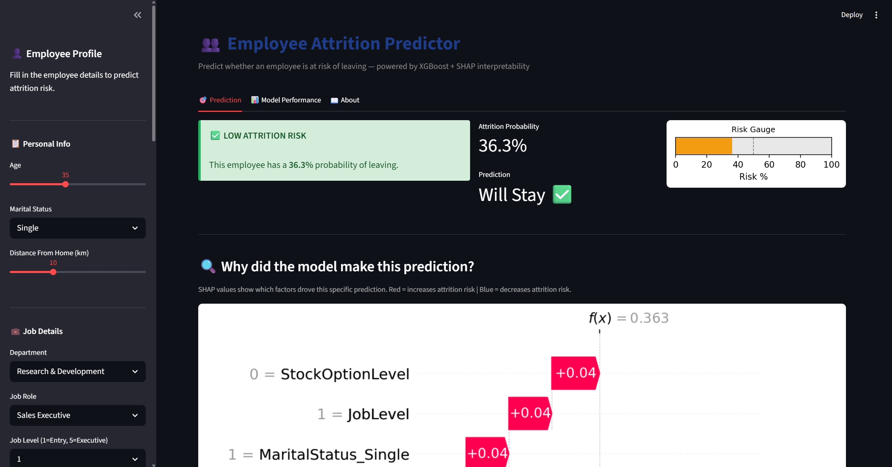
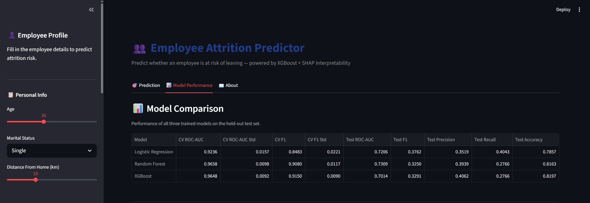

# 👥 Employee Attrition Predictor

> A complete, end-to-end machine learning project that predicts whether an employee is at risk of leaving a company — with full model interpretability powered by SHAP.

<a href="https://employee-attrition-predictor-ml.streamlit.app" target="_blank">
  
</a>

---

## 🌐 Live Demo

> **The app is fully deployed and accessible online — no installation required.**

<a href="https://employee-attrition-predictor-ml.streamlit.app" target="_blank">👉 Click here to open the live app</a>

Input any employee profile using the sidebar and instantly see:
- The predicted attrition probability and risk classification
- A SHAP waterfall chart explaining exactly which factors drove that prediction
- A full model performance dashboard with ROC curves, confusion matrices, and global feature importance charts

> ⚠️ Hosted on Streamlit Community Cloud free tier. If the app has been inactive for several days it may take ~30 seconds to wake up — just press the **"Wake up"** button if prompted.

---

## 🖼️ App Preview

| Prediction Tab | Model Performance Tab |
|---|---|
|  |  |

---

## 📌 Project Overview

Employee attrition — the rate at which employees leave a company — costs organizations enormous amounts of money in recruitment, onboarding, and lost productivity. This project builds a machine learning pipeline that:

- **Identifies** which employees are most at risk of leaving
- **Explains** the specific reasons behind each prediction using SHAP
- **Quantifies** risk with a probability score for every employee profile
- **Visualizes** everything through an interactive web application

The project follows a professional, end-to-end data science workflow: from raw data exploration all the way to a deployed interactive app.

---

## 📁 Project Structure

```
employee-attrition/
│
├── data/                         ← Raw and processed datasets + saved plots
│   ├── attrition.csv             ← Original IBM HR dataset
│   ├── X_train_final.csv         ← Processed training features (post-SMOTE)
│   ├── X_test_final.csv          ← Processed test features
│   ├── y_train.csv               ← Training labels
│   ├── y_test.csv                ← Test labels
│   ├── model_results.csv         ← Model comparison table
│   └── *.png                     ← All saved visualizations
│
├── notebooks/
│   ├── 01_EDA.ipynb              ← Exploratory Data Analysis
│   ├── 02_Preprocessing.ipynb    ← Data cleaning, encoding, scaling, SMOTE
│   ├── 03_Feature_Engineering.ipynb  ← Feature creation & selection
│   ├── 04_Model_Building.ipynb   ← Model training & evaluation
│   └── 05_SHAP_Interpretability.ipynb ← SHAP explanations
│
├── models/                       ← Saved model artifacts
│   ├── best_model.pkl            ← Best performing model
│   ├── all_models.pkl            ← All three trained models
│   ├── scaler.pkl                ← Fitted StandardScaler
│   ├── imputer.pkl               ← Fitted SimpleImputer
│   ├── selected_features.pkl     ← Final 30 selected feature names
│   ├── shap_explainer.pkl        ← SHAP TreeExplainer
│   └── shap_values.npy           ← Precomputed SHAP values
│
├── app/
│   └── app.py                    ← Streamlit web application
│
├── assets/                       ← Screenshots for this README
├── requirements.txt
├── .gitignore
└── README.md
```

---

## 📊 Dataset

**IBM HR Analytics Employee Attrition Dataset**

| Property | Value |
|---|---|
| Source | [Kaggle — IBM HR Analytics](https://www.kaggle.com/datasets/pavansubhasht/ibm-hr-analytics-attrition-dataset) |
| Rows | 1,470 employees |
| Features | 35 columns |
| Target | `Attrition` (Yes / No) |
| Class balance | 84% Stayed · 16% Left |
| Missing values | None |

The dataset covers a wide range of employee attributes including demographics, job role, compensation, tenure, satisfaction scores, and work-life balance ratings — making it rich enough for meaningful feature engineering and modeling.

---

## 🔬 Methodology

### Phase 1 — Exploratory Data Analysis
Performed a thorough investigation of all 35 features before touching any model. Key findings:
- **16% attrition rate** — significant class imbalance requiring special handling
- **OverTime** showed the single strongest visual separation between leavers and stayers
- **Low MonthlyIncome**, **young age**, and **early tenure** consistently associated with higher attrition
- 4 zero-variance columns identified and flagged for removal (`StandardHours`, `Over18`, `EmployeeCount`, `EmployeeNumber`)
- All satisfaction scales (Job, Environment, Relationship, Work-Life) showed inverse relationship with attrition

### Phase 2 — Data Preprocessing
- Dropped 4 uninformative columns
- Encoded target variable (`Yes → 1`, `No → 0`)
- Applied **Label Encoding** to binary categorical features
- Applied **One-Hot Encoding** to multi-class categorical features (`drop_first=True` to avoid multicollinearity)
- Applied **StandardScaler** to continuous numerical features — fitted on training set only to prevent data leakage
- Applied **SMOTE** (Synthetic Minority Over-sampling Technique) to training set only, balancing classes from 84/16 to 50/50

### Phase 3 — Feature Engineering
Created 7 new domain-driven features from existing columns:

| Feature | Formula | Business Rationale |
|---|---|---|
| `IncomePerYearExp` | MonthlyIncome / (TotalWorkingYears + 1) | Underpaid relative to experience → higher risk |
| `YearsWithoutPromotion` | YearsAtCompany − YearsSinceLastPromotion | Career stagnation → higher risk |
| `SatisfactionScore` | Mean of 4 satisfaction columns | Composite wellbeing signal |
| `ManagerLoyaltyRatio` | YearsWithCurrManager / (YearsAtCompany + 1) | Manager relationship stability |
| `CareerGrowthRate` | JobLevel / (TotalWorkingYears + 1) | Progression speed relative to experience |
| `IsEarlyCareer` | YearsAtCompany ≤ 2 | First 2 years = statistically highest attrition risk |
| `IsOverduePromotion` | YearsSinceLastPromotion ≥ 4 | Promotion frustration threshold |

Feature selection was performed using **Random Forest feature importance**, retaining the top 30 most informative features.

### Phase 4 — Model Building & Evaluation

Three models were trained and evaluated using **5-fold stratified cross-validation**:

| Model | CV ROC-AUC | Test ROC-AUC | Test F1 | Test Recall |
|---|---|---|---|---|
| Logistic Regression | 0.9236 | 0.7206 | 0.3762 | 0.4043 |
| Random Forest | 0.9658 | 0.7309 | 0.3250 | 0.2766 |
| XGBoost | 0.9648 | 0.7014 | 0.3291 | 0.2766 |

> **Primary metric: ROC-AUC** — chosen over accuracy because the dataset is imbalanced. A naive classifier predicting "Stayed" for every employee achieves 84% accuracy but has zero business value.
>
> **Secondary metric: Recall** — in an HR context, a False Negative (missing an at-risk employee) is more costly than a False Positive (flagging someone who would have stayed).

### Phase 5 — Model Interpretability (SHAP)
Used **SHAP (SHapley Additive exPlanations)** to explain model predictions at both global and individual level:

- **Summary Plot (Beeswarm)** — shows direction and magnitude of each feature's impact across all employees
- **Bar Chart** — clean ranking of average feature importance
- **Dependence Plot** — reveals how the top feature interacts with the second most important feature
- **Waterfall Charts** — explains a single employee's prediction step by step
- **Heatmap** — visualizes SHAP values across all sampled employees simultaneously

---

## 📈 Key Results & Insights

**Top attrition drivers identified by SHAP:**
1. **OverTime** — the single strongest predictor; employees working overtime showed dramatically elevated risk
2. **SatisfactionScore** — composite satisfaction acts as a strong protective factor; low scores strongly predict attrition
3. **MonthlyIncome / IncomePerYearExp** — lower compensation, especially relative to experience, significantly increases risk
4. **StockOptionLevel** — employees with no stock options leave at a much higher rate
5. **MaritalStatus (Single)** — single employees consistently show higher attrition across all models
6. **YearsAtCompany / IsEarlyCareer** — the first two years represent the highest-risk window for any employee

---

## 🛠️ Technical Stack

| Category | Tools |
|---|---|
| Language | Python 3.11+ |
| Data Processing | pandas, numpy |
| Visualization | matplotlib, seaborn |
| Machine Learning | scikit-learn, xgboost |
| Imbalance Handling | imbalanced-learn (SMOTE) |
| Interpretability | shap |
| Web App | streamlit |
| Deployment | Streamlit Community Cloud |
| Environment | Jupyter Notebooks + VS Code |
| Version Control | Git + GitHub |

---

## 🖥️ App Features

The interactive Streamlit app is live at <a href="https://employee-attrition-predictor-ml.streamlit.app" target="_blank">employee-attrition-predictor-ml.streamlit.app</a> and includes three tabs:

**🎯 Prediction Tab**
- Full employee profile input form in the sidebar (age, role, compensation, satisfaction scores, tenure)
- Live attrition probability score and risk classification
- Visual risk gauge
- SHAP waterfall chart explaining exactly why the model made that specific prediction

**📊 Model Performance Tab**
- Full model comparison table (all three models, all metrics)
- Global SHAP summary and bar charts
- ROC curves and confusion matrices for all models

**📖 About Tab**
- Project methodology summary
- Dataset information
- Technical stack overview

---

## 🚀 Run Locally

If you want to run the project on your own machine:

### 1. Clone the repository
```bash
git clone https://github.com/emaadkalantarii/employee-attrition.git
cd employee-attrition
```

### 2. Create and activate a virtual environment
```bash
# Windows
python -m venv venv
venv\Scripts\activate

# macOS / Linux
python -m venv venv
source venv/bin/activate
```

### 3. Install dependencies
```bash
pip install -r requirements.txt
```

### 4. Download the dataset
Download `WA_Fn-UseC_-HR-Employee-Attrition.csv` from [Kaggle](https://www.kaggle.com/datasets/pavansubhasht/ibm-hr-analytics-attrition-dataset), rename it to `attrition.csv`, and place it in the `data/` folder.

### 5. Run the notebooks in order
```
01_EDA.ipynb
02_Preprocessing.ipynb
03_Feature_Engineering.ipynb
04_Model_Building.ipynb
05_SHAP_Interpretability.ipynb
```

### 6. Launch the app
```bash
streamlit run app/app.py
```

---

## 📂 Reproducing Results

All notebooks are self-contained and run sequentially. Each notebook saves its outputs (processed data, trained models, plots) so the next one can load them directly. No notebook depends on anything except the outputs of the previous one and the original `attrition.csv`.

---

## 👤 Author

**Emad Kalantari**

[](https://github.com/emaadkalantarii)
[](https://github.com/emaadkalantarii/employee-attrition)
<a href="https://employee-attrition-predictor-ml.streamlit.app" target="_blank"></a>

---

## 📄 License

This project is open source and available under the [MIT License](LICENSE).
